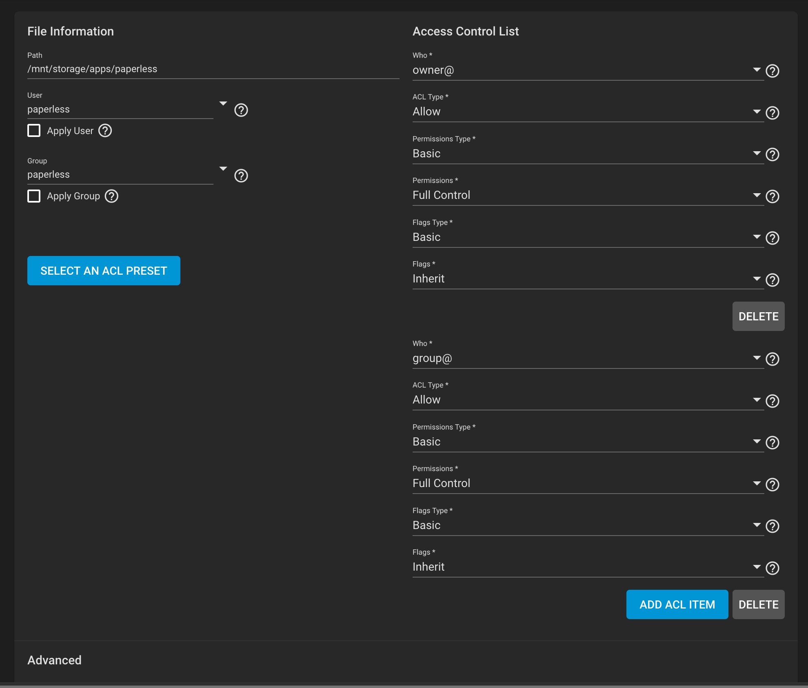

# Ben's Homelab


## Running ansible playbooks

### Dependencies

```shell

ansible-galaxy collection install community.docker

```

Use the docker-host playbook located in `ansible/docker-host` to provision the docker host

```shell

ansible-playbook -i inventory.yml playbook.yml
```

## Todos


## Notes

### Paperless

Setting up the shared in freenas is tricky. The scanner user (scanner) is a member of the paperless
group, but documents uploaded to the consume directory must have sufficient permissions so that the
paperless user can read and delete those file. 

The group@ permissions must be set to "Full Control" so that the scanner user creates documents
with implicit


